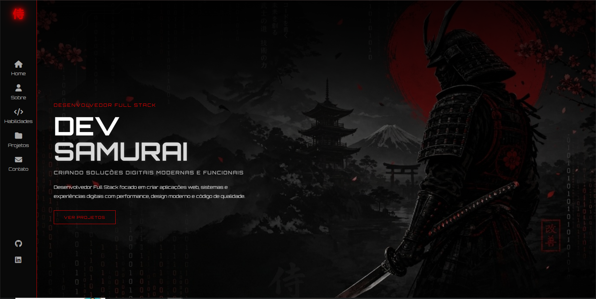
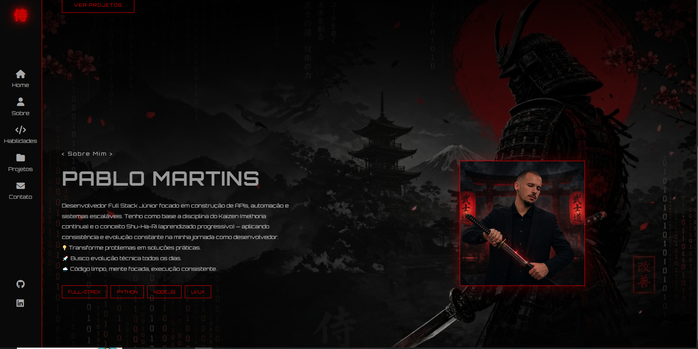
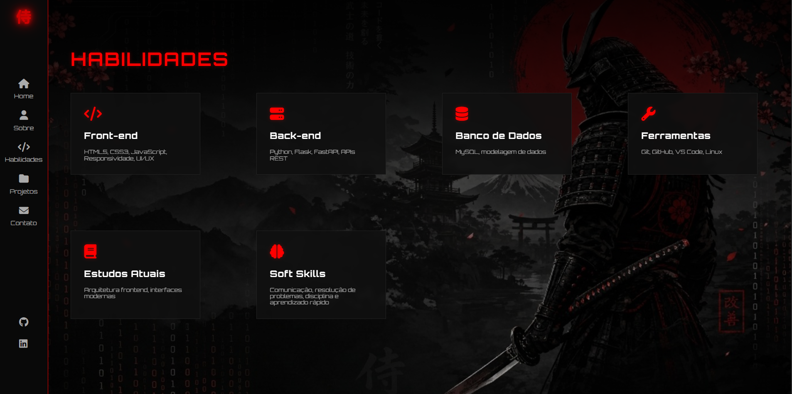
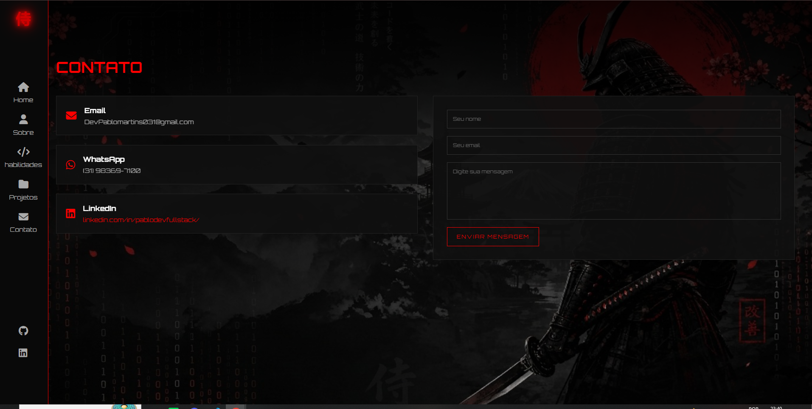
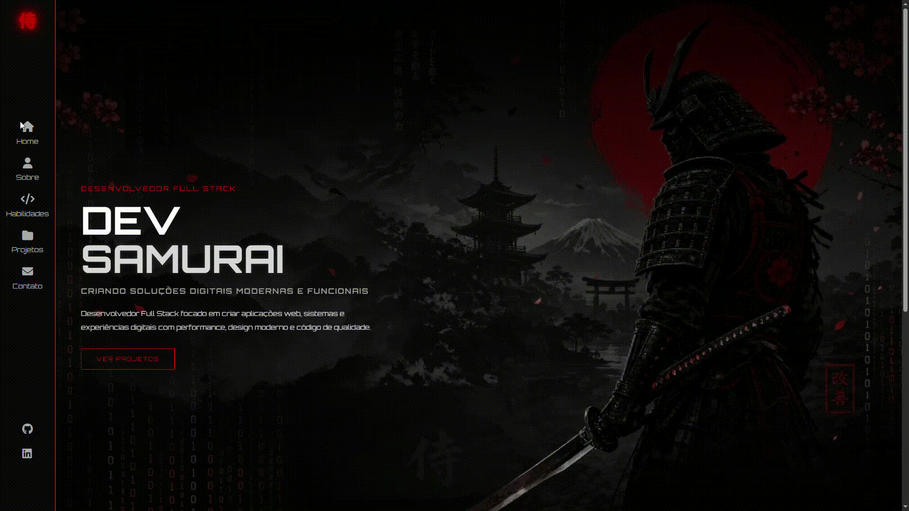

# ⚔️ Dev Samurai — Portfólio Cyberpunk

<p align="center">


</p>

<p align="center">
  
</p>

<p align="center">

Portfólio profissional desenvolvido para apresentar minha trajetória, habilidades e projetos como <strong>Desenvolvedor Full Stack</strong>.

Inspirado na estética <strong>Samurai</strong> e <strong>Cyberpunk</strong>, o projeto combina design futurista, animações modernas e uma arquitetura organizada para demonstrar conhecimentos em Front-end, Back-end e boas práticas de desenvolvimento.

</p>

---

# 🚀 Preview

## 🏠 Página Inicial

<p align="center">

</p>

---

## 📸 Páginas

<p align="center">





</p>

<p align="center">




</p>

---

# 🎥 Demonstração

<p align="center">

</p>

---

# 📸 Destaques

- Interface inspirada na estética Samurai e Cyberpunk
- Layout totalmente responsivo
- Animações com JavaScript
- API REST desenvolvida em FastAPI
- Persistência de dados utilizando MySQL
- Documentação automática com Swagger

---

# 🎨 Conceito

O projeto foi criado para unir:

- ⚔️ Cultura Samurai
- 🌆 Estética Cyberpunk
- 💻 Interfaces Modernas
- 🚀 Desenvolvimento Full Stack
- ✨ Animações e efeitos visuais
- 📱 Responsividade
- 🧩 Código organizado e modular

---

# 🛠️ Tecnologias

## Front-end

- HTML5
- CSS3
- JavaScript (ES6+)

## Back-end

- Python 3.13
- FastAPI
- SQLAlchemy ORM
- PyMySQL
- Pydantic
- Uvicorn

## Banco de Dados

- MySQL

## Bibliotecas

- Font Awesome
- python-dotenv
- python-multipart
- email-validator

## Ferramentas

- Git
- GitHub
- Visual Studio Code

---

# ✨ Funcionalidades

- ✅ Layout Responsivo
- ✅ Sidebar fixa
- ✅ Scroll suave
- ✅ Reveal Animation
- ✅ Navegação dinâmica
- ✅ JavaScript modular
- ✅ Formulário de contato
- ✅ Backend em FastAPI
- ✅ API REST
- ✅ Persistência de dados com MySQL
- ✅ Validação de dados com Pydantic
- ✅ Documentação automática (Swagger)
- ✅ Estrutura em camadas (Models, Routers, Schemas e Services)
- ✅ Organização profissional de código

---

# 📁 Estrutura

```text
meu-portifolio/
│
├── assets/
│   ├── css/
│   ├── js/
│   ├── images/
│   └── readme/
│
├── backend/
│   ├── app/
│   │   ├── models/
│   │   ├── routers/
│   │   ├── schemas/
│   │   └── services/
│   │
│   ├── database.py
│   ├── main.py
│   ├── requirements.txt
│   └── .env
│
├── index.html
├── habilidades.html
├── projetos.html
├── contato.html
├── README.md
└── .gitignore
```

---

# 🏗️ Arquitetura

```text
                          Front-end
         HTML • CSS • JavaScript
                    │
                    ▼
              Fetch API
                    │
                    ▼
            FastAPI (Python)
                    │
        ┌───────────┴───────────┐
        │                       │
     Routers                Schemas
        │                       │
        ▼                       ▼
      Services  ─────────▶  Pydantic
        │
        ▼
      Models
        │
        ▼
    SQLAlchemy ORM
        │
        ▼
       MySQL
```

---

# 🧠 Conceitos Aplicados

Durante o desenvolvimento foram utilizados conceitos como:

- Organização de projetos
- Arquitetura de pastas
- Modularização
- Responsividade
- Clean Code
- APIs REST
- FastAPI
- SQLAlchemy
- Integração Front-end + Back-end
- Git Flow
- Versionamento profissional
- UI/UX
- Estruturas escaláveis

---

# 📱 Responsividade

O projeto está preparado para:

- 💻 Desktop
- 💼 Notebook
- 📱 Smartphone
- 📟 Tablet

---

# 🚀 Roadmap
# 🚀 Roadmap

## 🎨 Front-end

- [x] Estrutura inicial
- [x] Layout responsivo
- [x] Página Inicial
- [x] Página Sobre
- [x] Página Habilidades
- [x] Página Projetos
- [x] Página Contato
- [x] Sidebar fixa
- [x] Scroll suave
- [x] Reveal Animation
- [x] JavaScript modular

---

## ⚙️ Back-end

- [x] Estrutura do Backend
- [x] API REST com FastAPI
- [x] Arquitetura em camadas (Models, Routers, Schemas e Services)
- [x] Integração com MySQL
- [x] SQLAlchemy ORM
- [x] Validação de dados com Pydantic
- [x] Configuração com variáveis de ambiente (.env)
- [x] Documentação automática com Swagger

---

## 🔄 Integração

- [ ] Integração do formulário com a API
- [ ] Feedback visual de envio (Sucesso/Erro)
- [ ] Validação no Front-end
- [ ] Loading durante o envio
- [ ] Limpeza automática do formulário

---

## 📋 Painel Administrativo

- [ ] Listagem de mensagens
- [ ] Visualização detalhada
- [ ] Exclusão de mensagens
- [ ] Filtro e pesquisa
- [ ] Paginação

---

## 🔐 Segurança

- [ ] Autenticação JWT
- [ ] Proteção das rotas administrativas
- [ ] Validação de permissões

---

## ☁️ Deploy

- [ ] Deploy do Front-end
- [ ] Deploy da API
- [ ] Banco de dados em produção
- [ ] Domínio personalizado
- [ ] HTTPS

---

## 🚀 Melhorias Futuras

- [ ] Dashboard administrativo completo
- [ ] Envio automático de e-mails
- [ ] Sistema de notificações
- [ ] Internacionalização (PT-BR / EN)
- [ ] SEO
- [ ] Docker
- [ ] Testes automatizados
---

# ⚙️ Como executar

## Front-end

Abra o arquivo:

```text
index.html
```

ou utilize a extensão **Live Server** do VS Code.

---

## Backend

Entre na pasta:

```bash
cd backend
```

Ative o ambiente virtual:

### Windows

```bash
.\.venv\Scripts\Activate.ps1
```

Instale as dependências:

```bash
pip install -r requirements.txt
```

Execute a API:

```bash
uvicorn main:app --reload
```

A aplicação ficará disponível em:

```text
http://127.0.0.1:8000
```

Documentação automática:

```text
http://127.0.0.1:8000/docs
```

---
# 🌐 API

A API foi desenvolvida com FastAPI e segue uma arquitetura em camadas.

### Endpoints

| Método | Endpoint | Descrição |
|---------|----------|-----------|
| GET | `/` | Verifica o status da API |
| POST | `/contato` | Envia uma mensagem pelo formulário |

### Documentação

```
http://127.0.0.1:8000/docs
```
---


# 👨‍💻 Autor

## Pablo Martins

Desenvolvedor Full Stack apaixonado por tecnologia, desenvolvimento web e interfaces modernas.

### Contato

- GitHub: <https://github.com/PabloMartins031>
- LinkedIn: <https://www.linkedin.com/in/pablodevfullstack/>

---

# 📄 Licença

Projeto desenvolvido para fins de estudo, prática e demonstração profissional.

Sinta-se à vontade para estudar o código, sugerir melhorias e contribuir com o projeto.

---

<p align="center">

⭐ Se este projeto foi útil para você, deixe uma estrela no repositório!

</p>
