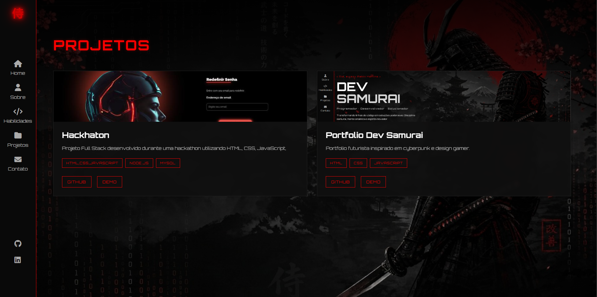

# ⚔️ Dev Samurai — Portfólio Cyberpunk

<p align="center">
  
</p>

<p align="center">

Portfólio profissional desenvolvido para apresentar minha trajetória, habilidades e projetos como <strong>Desenvolvedor Full Stack</strong>.

Inspirado na estética <strong>Samurai</strong> e <strong>Cyberpunk</strong>, o projeto combina design futurista, animações modernas e uma arquitetura organizada para demonstrar conhecimentos em Front-end, Back-end e boas práticas de desenvolvimento.

</p>

---

# 🚀 Preview

## 🏠 Página Inicial

<p align="center">

</p>

---

## 📸 Páginas

<p align="center">


</p>

<p align="center">




</p>

---

# 🎥 Demonstração

<p align="center">

</p>

---

# 🎨 Conceito

O projeto foi criado para unir:

- ⚔️ Cultura Samurai
- 🌆 Estética Cyberpunk
- 💻 Interfaces Modernas
- 🚀 Desenvolvimento Full Stack
- ✨ Animações e efeitos visuais
- 📱 Responsividade
- 🧩 Código organizado e modular

---

# 🛠️ Tecnologias

## Front-end

- HTML5
- CSS3
- JavaScript (ES6+)

## Back-end

- Python
- FastAPI
- SQLAlchemy
- PyMySQL

## Banco de Dados

- MySQL

## Ferramentas

- Git
- GitHub
- Visual Studio Code

## Bibliotecas

- Font Awesome

---

# ✨ Funcionalidades

- ✅ Layout Responsivo
- ✅ Sidebar fixa
- ✅ Scroll suave
- ✅ Reveal Animation
- ✅ Navegação dinâmica
- ✅ JavaScript modular
- ✅ Página Inicial
- ✅ Página Sobre
- ✅ Página Habilidades
- ✅ Página Projetos
- ✅ Página Contato
- ✅ Backend em FastAPI
- ✅ Estrutura preparada para MySQL
- ✅ Organização profissional de código

---

# 📁 Estrutura

```text
meu-portifolio/
│
├── assets/
│   ├── css/
│   ├── js/
│   │   ├── main.js
│   │   ├── menu.js
│   │   ├── reveal.js
│   │   ├── scroll.js
│   │   └── contato.js
│   │
│   └── images/
│       └── readme/
│
├── backend/
│   ├── app/
│   │   ├── models/
│   │   ├── routers/
│   │   ├── schemas/
│   │   ├── database.py
│   │   └── main.py
│   │
│   ├── requirements.txt
│   └── .venv/
│
├── index.html
├── habilidades.html
├── projetos.html
├── contato.html
├── README.md
└── .gitignore
```

---

# 🏗️ Arquitetura

```text
           Front-end
     HTML • CSS • JavaScript
               │
               ▼
          Fetch API
               │
               ▼
          FastAPI (Python)
               │
               ▼
         SQLAlchemy ORM
               │
               ▼
             MySQL
```

---

# 🧠 Conceitos Aplicados

Durante o desenvolvimento foram utilizados conceitos como:

- Organização de projetos
- Arquitetura de pastas
- Modularização
- Responsividade
- Clean Code
- APIs REST
- FastAPI
- SQLAlchemy
- Integração Front-end + Back-end
- Git Flow
- Versionamento profissional
- UI/UX
- Estruturas escaláveis

---

# 📱 Responsividade

O projeto está preparado para:

- 💻 Desktop
- 💼 Notebook
- 📱 Smartphone
- 📟 Tablet

---

# 🚀 Roadmap

- [x] Estrutura inicial
- [x] Layout responsivo
- [x] Página Sobre
- [x] Página Habilidades
- [x] Página Projetos
- [x] Página Contato
- [x] Organização do JavaScript
- [x] Estrutura do Backend
- [ ] API completa com FastAPI
- [ ] Integração com MySQL
- [ ] Envio de mensagens
- [ ] Dashboard administrativo
- [ ] Deploy da API
- [ ] Deploy do Portfólio
- [ ] SEO
- [ ] Internacionalização

---

# ⚙️ Como executar

## Front-end

Abra o arquivo:

```text
index.html
```

ou utilize a extensão **Live Server** do VS Code.

---

## Backend

Entre na pasta:

```bash
cd backend
```

Ative o ambiente virtual:

### Windows

```bash
.\.venv\Scripts\Activate.ps1
```

Instale as dependências:

```bash
pip install -r requirements.txt
```

Execute a API:

```bash
uvicorn app.main:app --reload
```

A aplicação ficará disponível em:

```text
http://127.0.0.1:8000
```

Documentação automática:

```text
http://127.0.0.1:8000/docs
```

---

# 👨‍💻 Autor

## Pablo Martins

Desenvolvedor Full Stack apaixonado por tecnologia, desenvolvimento web e interfaces modernas.

### Contato

- GitHub: https://github.com/PabloMartins031
- LinkedIn: https://www.linkedin.com/in/pablodevfullstack/

---

# 📄 Licença

Projeto desenvolvido para fins de estudo, prática e apresentação profissional.

---

<p align="center">

⭐ Se este projeto foi útil para você, deixe uma estrela no repositório!

</p>
